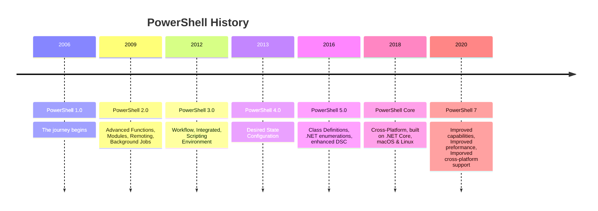

```mermaid
timeline
    title PowerShell History 
    2006: PowerShell 1.0: The journey begins
    2009: PowerShell 2.0: Advanced Functions, Modules, Remoting, Background Jobs
    2012: PowerShell 3.0: Workflow, Integrated, Scripting Environment
    2013: PowerShell 4.0: Desired State Configuration
    2016: PowerShell 5.0: Class Definitions, .NET enumerations, enhanced DSC
    2018: PowerShell Core: Cross-Platform, built on .NET Core, macOS & Linux
    2020: PowerShell 7: Improved capabilities, Improved preformance, Imporved cross-platform support
```